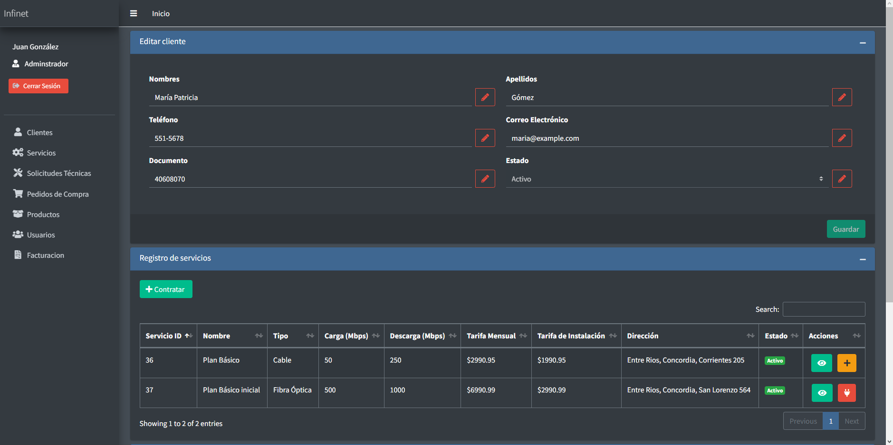

# Proyecto - Práctica Profesional

## Comienzo

En el repositorio se encuentra una carpeta llamada Database, donde se encuentra una copia de la base de datos sugerida para la prueba de este proyecto.

Se debera crear una base de datos de nombre infinet y el usuario predeterminado root

| Parámetro                      | Valor       |
| ------------------------------ | ----------- |
| **Nombre de la Base de Datos** | `infinet`   |
| **Usuario**                    | `root`      |
| **Contraseña**                 | (vacío)     |
| **Host**                       | `localhost` |

Una vez con la base de datos funcionando para ingresar a la plataforma se brindan las siguientes credenciales.

### Credenciales

| Usuario | Contraseña  | Rol           |
| ------- | ----------- | ------------- |
| 000001  | contraseña1 | Administrador |
| 000002  | contraseña2 | Técnico       |
| 000003  | contraseña3 | Secretario    |
| 000004  | contraseña4 | Administrador |
| 000005  | contraseña5 | Téccnico      |
| 000006  | contraseña6 | Secretario    |

## Usuarios y Roles

En este proyecto, los usuarios están definidos y caracterizados por su rol, que puede ser Administrador, Técnico o Secretario. El rol determina la construcción de las vistas y los permisos de acceso en la plataforma.

- ### Administrador

El Administrador tiene acceso completo a los sistemas de gestión, lo que le permite realizar funciones diversas para el control y la administración del sistema.


Panel del administrador

- ### Tecnico

El Técnico es un tipo de usuario orientado a su labor, con acceso a un conjunto limitado de vistas y una dinámica centrada en las solicitudes técnicas


Panel del tecnico


Panel del solicitudes tecnicas para el tecnico

- ### Secretario

El Secretario es otro tipo de usuario orientado a sus funciones, que incluyen la atención al cliente, la venta de servicios y actúa como intermediario entre el cliente y la empresa.


Panel del secretario

## Clientes

Esta sección de la plataforma se enfoca en la creación, búsqueda y edición de clientes. Es importante destacar que los clientes no son eliminados de los registros, sino que se desactivan.


Pagina clientes


Formulario de registro de un nuevo cliente


Pagina de perfil del cliente

Esta seccion no solo esta orientada al registro, tambien tiene a la venta de servicios, los servicios cuentan con su propia seccion de gestion en servicios.

Se puede contratar un servicio a un cliente.


Formulario de contratacion de servicio

Si se contrata un servicio instantaneamente se creara una solicitud tecnica de tipo instalacion vinculada al nuevo servicio contratado. Esta estara a la espera de que un tecnico se haga cargo de su caso.


Solicitud tecnica de instalacion de un nuevo servicio

Tambien se brinda la opcion de ante un reclamo de un cliente en un servicio ya activo abrir un solicitud tecnica de tipo mantenimiento asociada con el servicio contratado.


Creacion de solicitud tecnica de reclamo

Se creara una solicitud tecnica de mantenimiento a la espera de un tecnico que se ocupe del caso.


_Los servicios no pueden tener mas de una solicitud tecnica abierta._

Los servicios contratados tampoco son fijos, estos pueden ser editados para su correccion o actualizacion.


Perfil de servicio contratado

Para concluir con el sistema relacionados con los clientes, se encuentra la seccion de facturacion.


Pagina de facturacion

Donde se encuentra un boton que dispara la consulta de generación de facturas, un proceso cronico del servidor. Para su demostracion queda vinculado a un boton en este caso.

El boton ejecuta la siguiente consulta

```sql
    INSERT INTO invoices (issue_date, due_date, client_service_id, type, price_service, price_installation, surcharge, state)
    SELECT
        CURDATE() AS issue_date,
        DATE_ADD(CURDATE(), INTERVAL 2 WEEK) AS due_date,
        cs.id AS client_service_id,
        2 AS type,
        (SELECT s.monthly_fee FROM services s WHERE s.service_id = cs.service_id) AS price_service,
        CASE
            WHEN cs.installation = 1 THEN (SELECT s.installation_fee FROM services s WHERE s.service_id = cs.service_id)
            ELSE 0
        END AS price_installation,
        (SELECT s.monthly_fee FROM services s WHERE s.service_id = cs.service_id) * 0.05 AS surcharge,
        2 AS state
    FROM client_services cs
    WHERE
        cs.state IN ('1', '2')
        AND cs.state NOT IN ('0', '3')
        AND NOT EXISTS (
            SELECT 1
            FROM invoices i
            WHERE cs.id = i.client_service_id
                AND MONTH(i.issue_date) = MONTH(NOW())
                AND YEAR(i.issue_date) = YEAR(NOW())
        )
        AND DATEDIFF(CURDATE(), cs.hire_date) >= 30;
```

Esta consulta SQL realiza una inserción en la tabla `invoices` utilizando datos seleccionados de la tabla `client_services`. Aquí hay una explicación paso a paso:

1. **Selección de Fechas:**

   - `CURDATE() AS issue_date`: Obtiene la fecha actual como la fecha de emisión de la factura.
   - `DATE_ADD(CURDATE(), INTERVAL 2 WEEK) AS due_date`: Calcula la fecha de vencimiento como la fecha actual más dos semanas.

2. **Selección de Datos de `client_services`:**

   - `cs.id AS client_service_id`: Obtiene el identificador único del servicio al cliente.
   - `2 AS type`: Establece el tipo de factura como 2.

3. **Selección de Precios:**

   - `(SELECT s.monthly_fee FROM services s WHERE s.service_id = cs.service_id) AS price_service`: Obtiene la tarifa mensual del servicio desde la tabla `services` usando `service_id` asociado al servicio del cliente.
   - `CASE WHEN cs.installation = 1 THEN (SELECT s.installation_fee FROM services s WHERE s.service_id = cs.service_id) ELSE 0 END AS price_installation`: Si la instalación está activada (`cs.installation = 1`), obtiene la tarifa de instalación desde la tabla `services`; de lo contrario, establece la tarifa de instalación en 0.

4. **Cálculo del Recargo:**

   - `(SELECT s.monthly_fee FROM services s WHERE s.service_id = cs.service_id) * 0.05 AS surcharge`: Calcula el recargo como el 5% de la tarifa mensual del servicio.

5. **Establecimiento del Estado:**

   - `2 AS state`: Establece el estado de la factura como 2.

6. **Filtrado de Servicios:**

   - `cs.state IN ('1', '2')`: Filtra los servicios con estado '1' o '2'.
   - `cs.state NOT IN ('0', '3')`: Excluye los servicios con estado '0' o '3'.

7. **Filtrado por Fecha y Existencia de Factura:**
   - `NOT EXISTS (...)`: Verifica que no exista ya una factura para el mismo servicio del cliente en el mismo mes y año.
   - `DATEDIFF(CURDATE(), cs.hire_date) >= 30`: Filtra los servicios que han estado activos por al menos 30 días.

En resumen, la consulta crea facturas para servicios específicos que cumplen con ciertos criterios de estado, tiempo de activación y la no existencia de facturas previas para el mismo mes y año.


Facturas generadas

## Servicios

Los servicios ofrecidos para la contratacion de clientes se gestionan en la seccion de servicios.


Pagina de servicios

En esta seccion se pueden crear, modificar, buscar y eliminar servicios que no esten vinculados a otros registros.


Formulario de creacion de servicio

El manejo de un servicio se realiza desde su perfil


Pagina de perfil de servicio


## Otros modulos

Para esta ocasion solo se han solicitado la gestion de usuarios, contratacion de servicios y atencion de los mismos. 